|已卖出|书名|
|---|---|
|1|设计模式：可复用面向对象软件的基础|
|2|计算机组成与体系结构：性能设计 |
|3|Head First HTML CSS|
|4|head first 设计模式|
|5|Effective Objective-C 2.0|
|6|Objective-C 高级编程 iOS 与 OS X 多线程和内存管理 |
|7|Objective-C 编程之道：iOS 设计模式解析|
|8|Head First Servlets and JSP|

这两本打包卖,未使用过,全新,但书的封面外皮有些许瑕疵.联系实图.
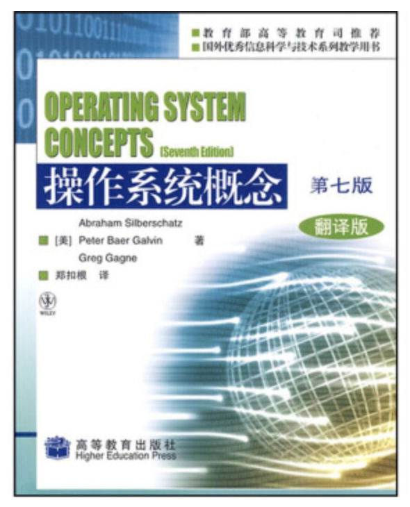   
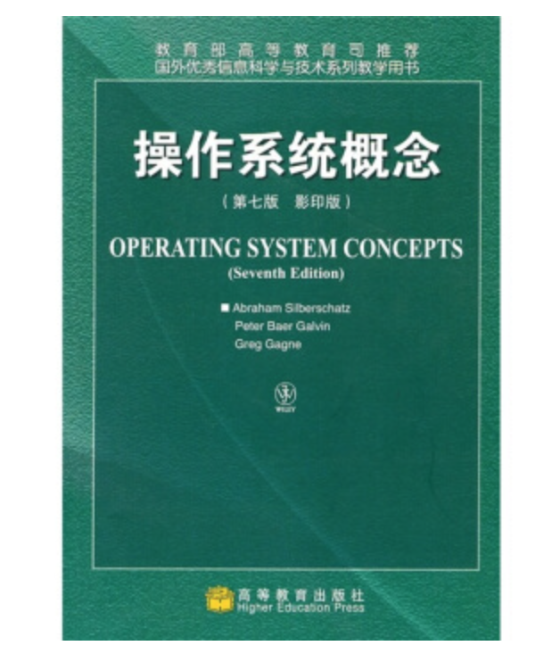
操作系统概念 第七版 影印版  72   
操作系统概念 第七版 翻译版  74   
两本打包价格 58  

Head First HTML与CSS 
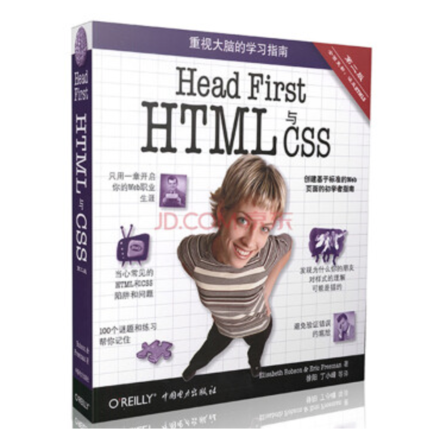
价格25

Head First 设计模式
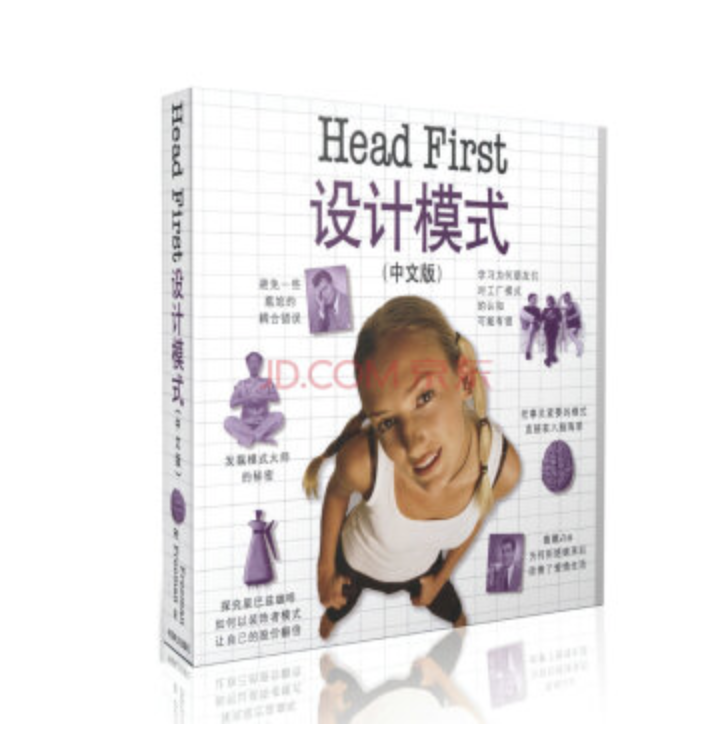
价格25

Head First EJB 

价格27

Head First Servlets and JSP
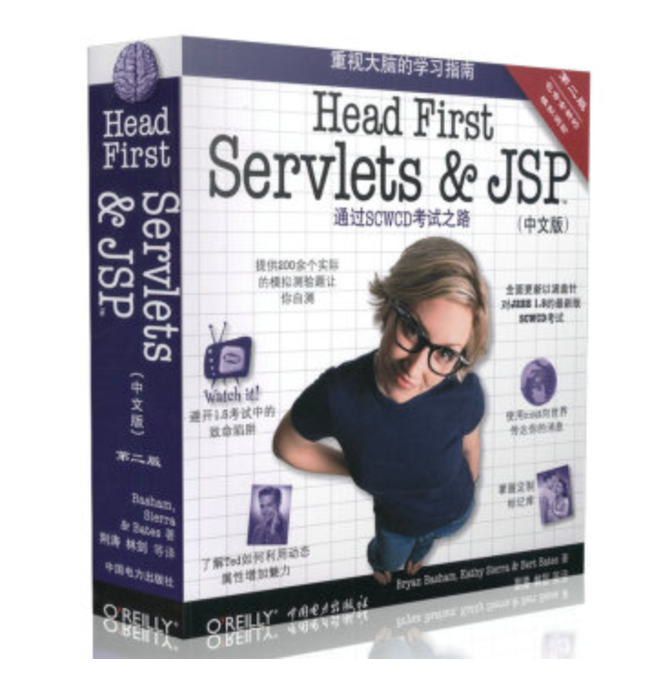
价格 35

设计模式：可复用面向对象软件的基础
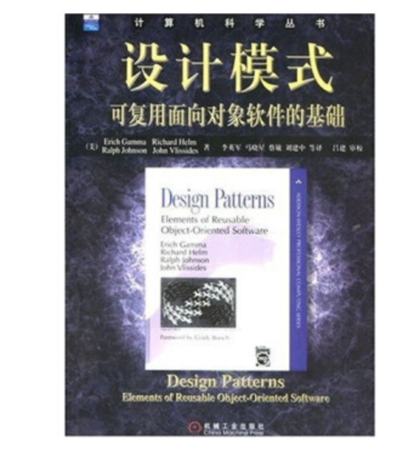
价格 11.5

计算机组成与体系结构：性能设计（原书第8版）
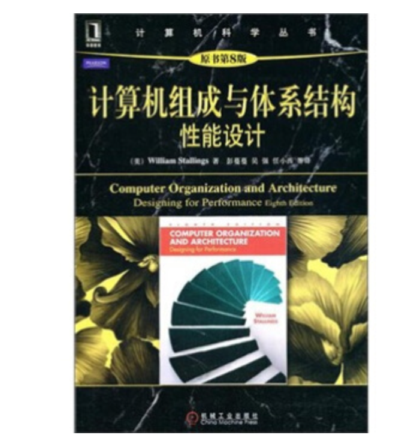 
价格:26

计算机组成与设计 硬件 软件接口(原书第4版) 
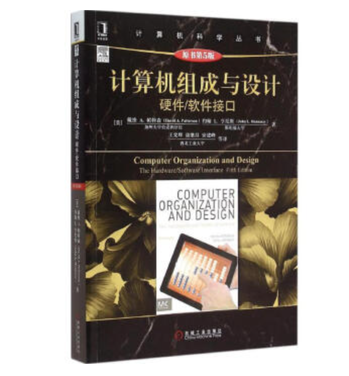
价格:30

C语言大学教程（第6版）

价格:31

软件开发视频大讲堂：Linux C从入门到精通
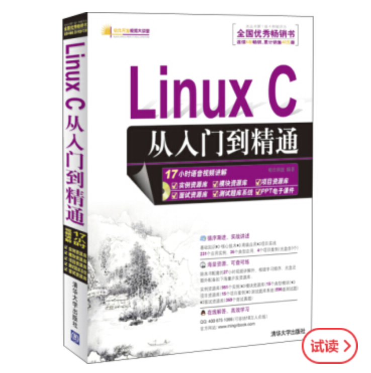
价格:23

javascript入门经典 

10元

C/C++/C#程序员实用大全  
很老的一本书,成色还很新,请百度此书,需要再买
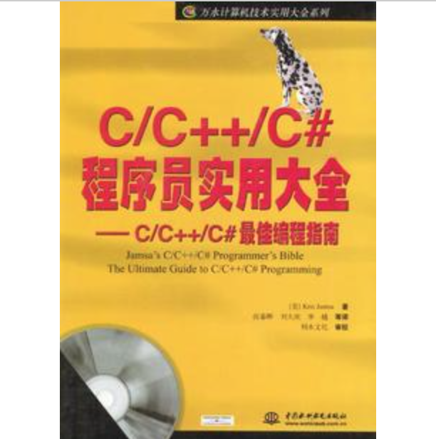
价格15

iOS开发范例实战宝典（基础篇+进阶篇）（套装共2册）
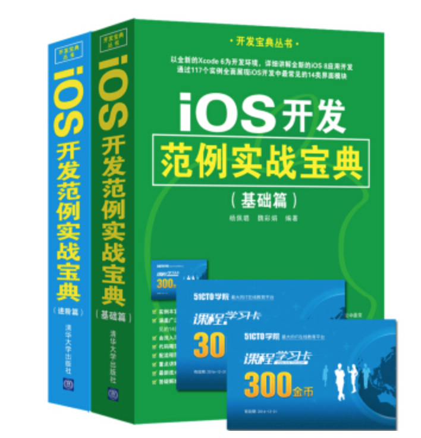
价格:60

Objective-C编程之道：iOS设计模式解析
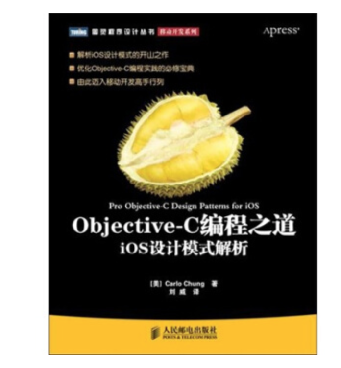
价格:19

Effective Objective-C 2.0：编写高质量iOS与OS X代码的52个有效方法

价格:15

iOS核心开发手册（原书第5版）
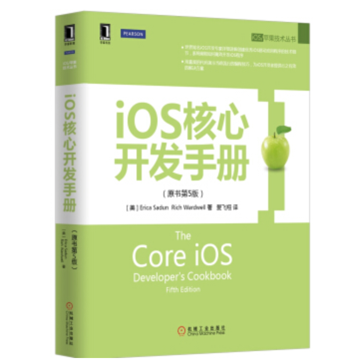
价格:35

iOS Auto Layout开发秘籍（第2版） 
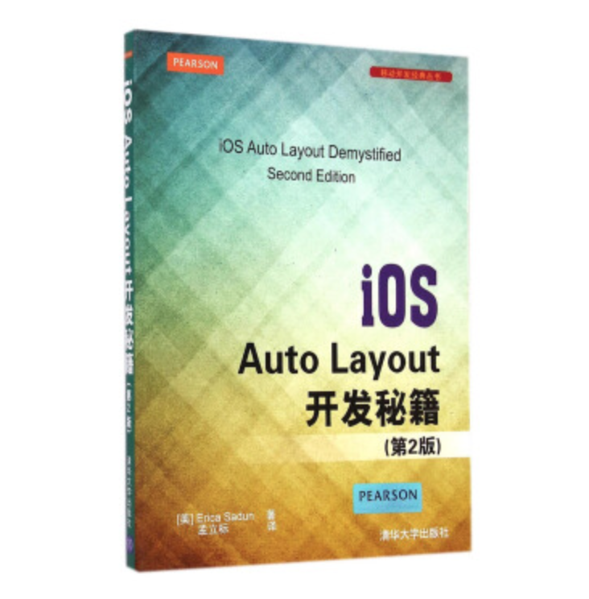
价格:14

精通iOS开发第6版
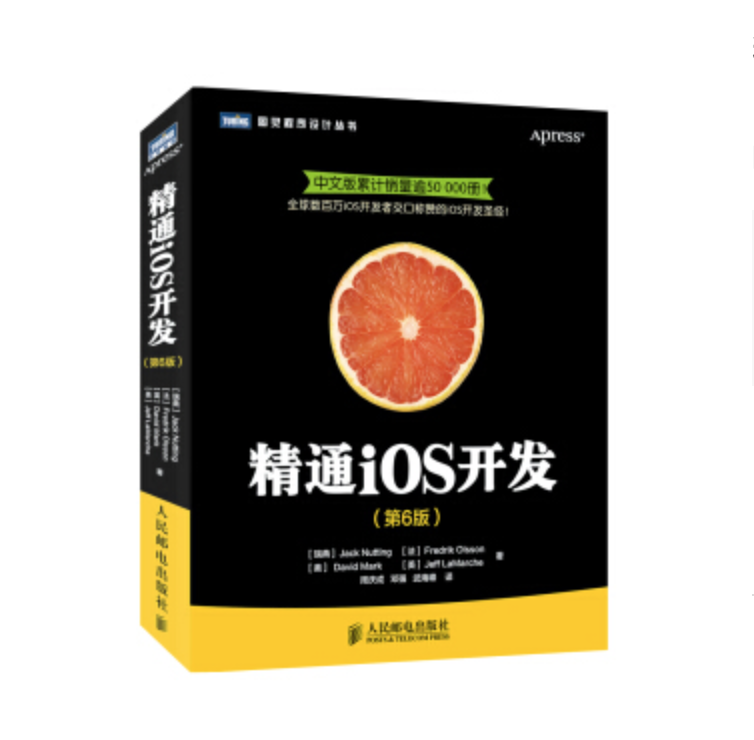
价格:20

Objective-C 2.0 Mac和iOS开发实践指南
基本全新,但品相有点问题,3折
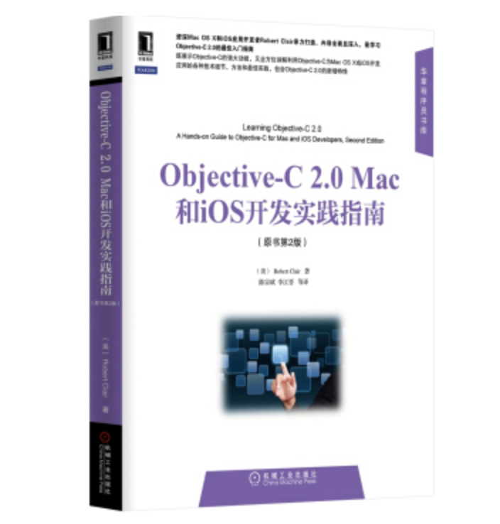
价格:20

Objective-C高级编程 iOS与OS X多线程和内存管理

价格:16

Objective-C基础教程 第2版
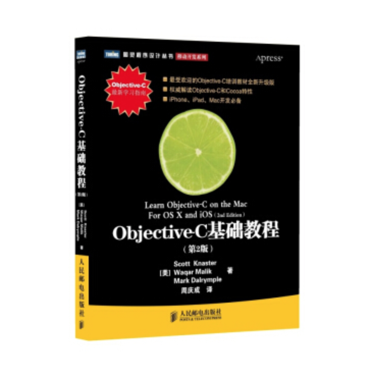
价格:19

Objective-C编程全解（第3版）
表皮品相稍差,右上角顶端有一处折痕,3.5折,内页全新

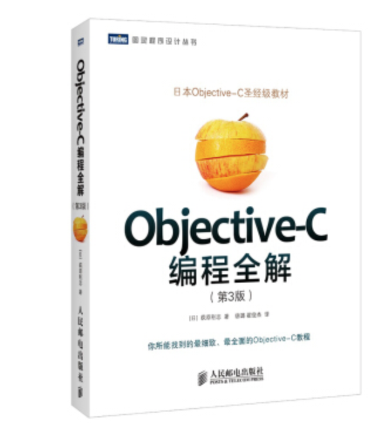

价格:23

iOS开发指南 从零基础到App Store上架（第3版）  
只适合入门看一眼,1.2折  
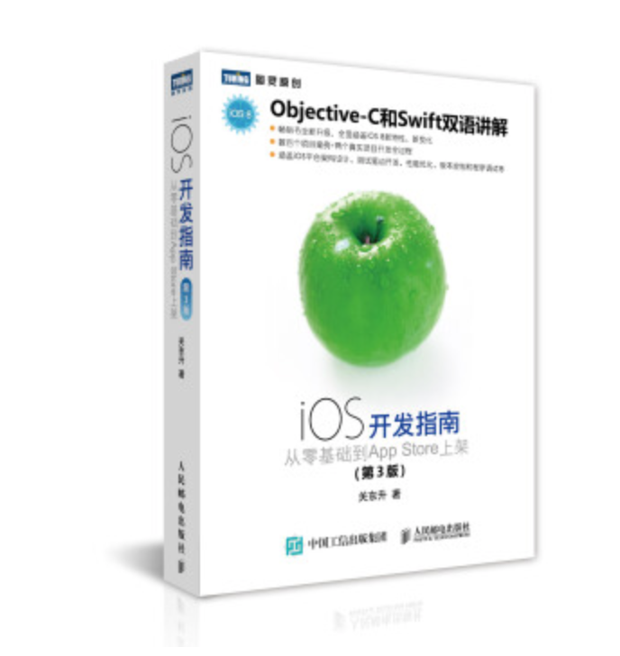
价格:10

